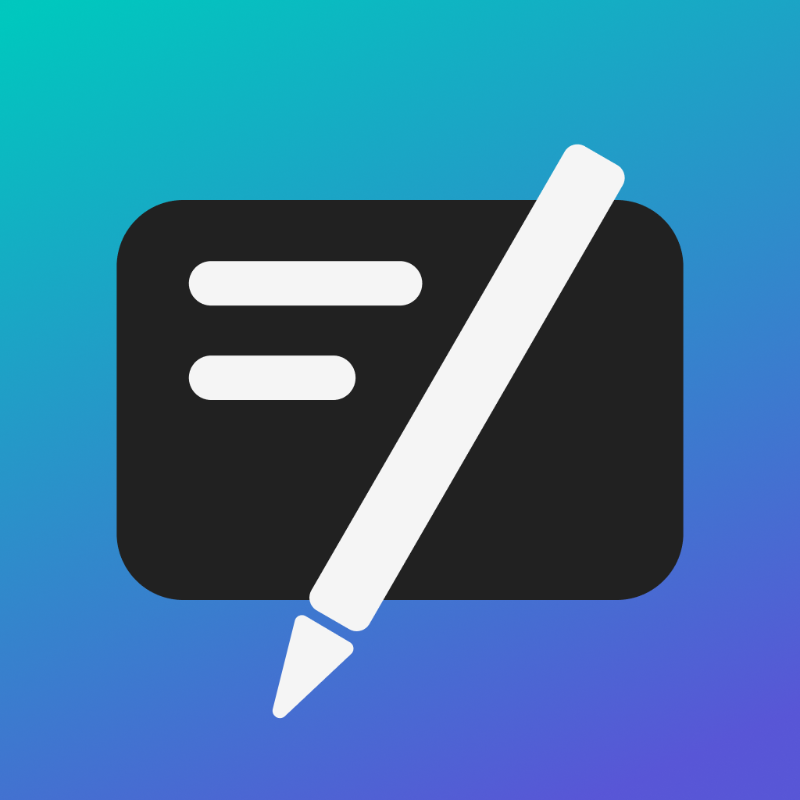

<p align="center">
  
</p>

<h1 align="center">TechKnowlEdgeConnect</h1>

<p align="center">
  <strong>Education app for learning and exchanging with others.</strong>
</p>

<p align="center">
  <a href="https://github.com/JensLe97/tech_knowl_edge_connect/actions/workflows/flutter.yml">
    
  </a>
  <a href="https://github.com/JensLe97/tech_knowl_edge_connect/actions/workflows/flutter-deploy.yml">
    
  </a>
  <a href="https://github.com/JensLe97/tech_knowl_edge_connect/actions/workflows/firebase-hosting-merge.yml">
    
  </a>
</p>

<p align="center">
  <a href="https://apps.apple.com/de/app/techknowledgeconnect/id6689203320">
    
  </a>
  <a href="https://play.google.com/store/apps/details?id=com.jenslemke.tech_knowl_edge_connect">
    
  </a>
</p>

<p align="center">
  🌐 Available at <a href="https://tech-knowl-edge-connect.jenslemke.com">tech-knowl-edge-connect.jenslemke.com</a>
</p>

---

## Table of Contents

- [About](#about)
- [GitHub Actions](#github-actions)
  - [Tests](#tests)
  - [Web Deployment](#web-deployment)
  - [Android Deployment](#android-deployment)
  - [iOS Deployment](#ios-deployment)

---

## About

TechKnowlEdgeConnect is a Flutter-based education app designed to help students learn through bite-sized lessons and exchange knowledge with peers. The app is available on Web, Android, and iOS platforms.

---

## GitHub Actions

Each commit triggers automated testing and builds to validate the codebase.

### Tests

Each commit runs Flutter tests and builds an Android appbundle to validate the build process.

### Web Deployment

Each commit to main will automatically deploy the web application to Firebase Hosting.

### Android Deployment

Each tag will create a new release and deploy an appbundle to the internal testers track in the Google Play Console.

1. Update the version number in `pubspec.yaml`
2. Create and publish a new tag with:

```bash
git tag vX.Y.Z
git push origin vX.Y.Z
```

#### Upload Screenshots in Google Play Console

| Device                | Resolution    |
| --------------------- | ------------- |
| Pixel 9 Emulator      | 1080 × 2424px |
| Pixel Tablet Emulator | 1600 × 2560px |

Select the release from the GitHub Actions builds and upload to Google Play Console.

### iOS Deployment

Each tag will trigger an Xcode build in Xcode Cloud with the version number from `pubspec.yaml`.

#### Upload Screenshots in App Store Connect

| Device                                 | Resolution    |
| -------------------------------------- | ------------- |
| iPhone 14 Plus iOS Simulator           | 1284 × 2778px |
| iPad Pro 13-inch (M4) iPadOS Simulator | 2064 × 2752px |

Select the release from the Xcode Cloud builds and upload to App Store Connect.
